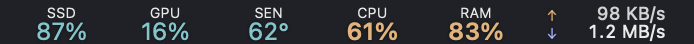
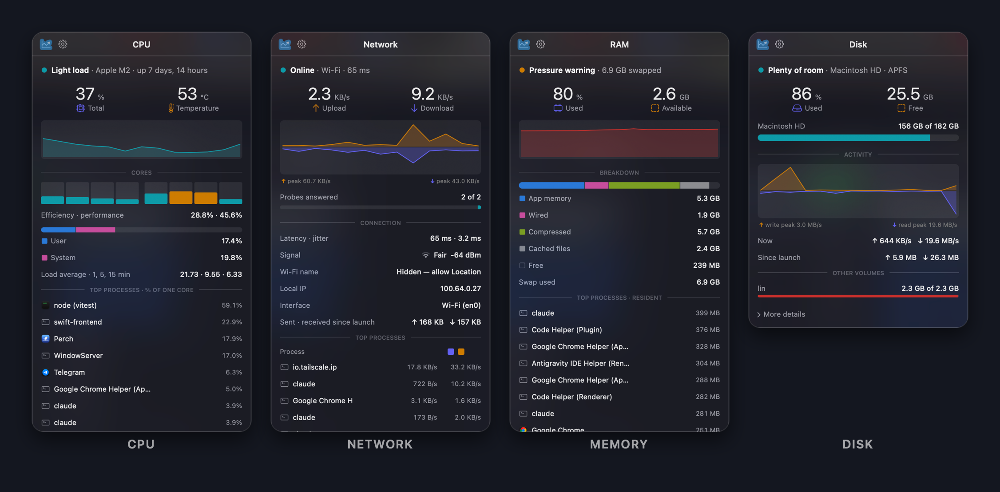
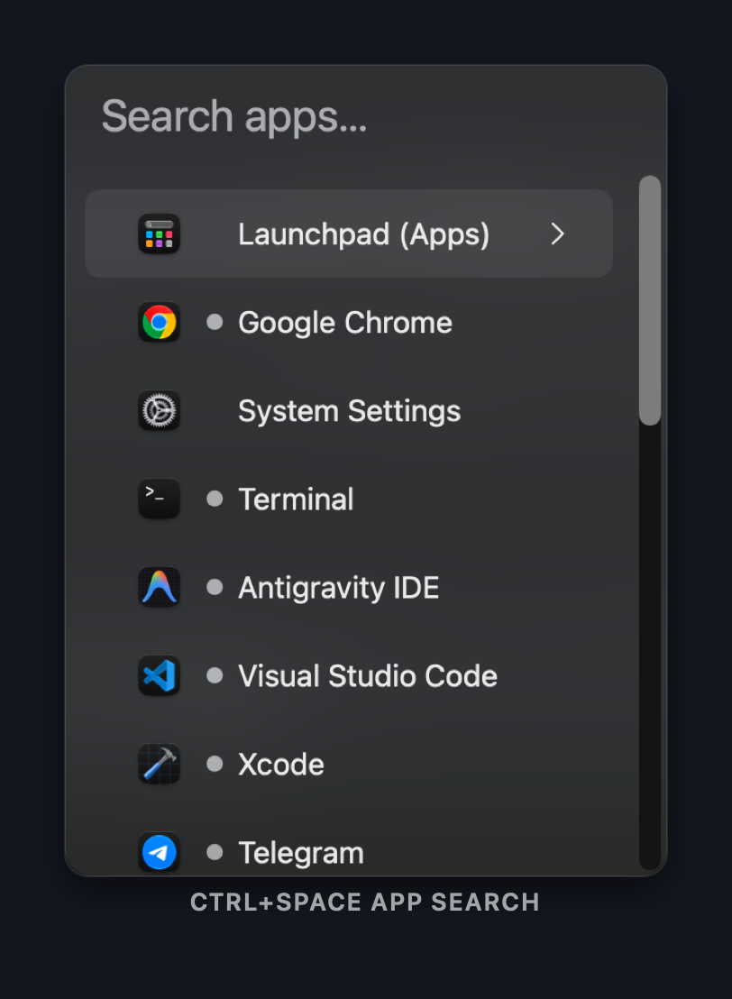

<p align="center">
  
</p>

<h1 align="center">Perch</h1>

<p align="center">
  <strong>Your Mac, at a glance and a keystroke.</strong><br>
  A native menu bar app that switches apps, places windows and watches your system —<br>
  in one quiet process, with no account, no telemetry and nothing to pay.
</p>

<p align="center">
  <a href="https://github.com/sagardn/Perch/releases/latest"></a>
  
  
  <a href="LICENSE"></a>
</p>

<p align="center">
  <a href="#install"><strong>Install</strong></a> ·
  <a href="#what-you-get"><strong>Features</strong></a> ·
  <a href="#keyboard-shortcuts"><strong>Shortcuts</strong></a> ·
  <a href="#privacy"><strong>Privacy</strong></a> ·
  <a href="docs/USER_MANUAL.md"><strong>Manual</strong></a> ·
  <a href="https://ko-fi.com/sagardn"><strong>Support</strong></a>
</p>

<br>

<p align="center">
  
</p>

<p align="center">
  
</p>

---

## Why Perch

Most Macs end up running three small utilities: one to launch and switch apps,
one to show what the machine is doing, and one more for the shortcut neither
of them has. Perch is all three, built as one native app.

<table>
  <tr>
    <td width="33%" valign="top">
      <h3>⚡️ Switch in a keystroke</h3>
      <code>⌃Space</code> opens a search panel wherever your pointer is. Type,
      press Return, and Perch launches, focuses, minimises or restores the app —
      whichever the moment needs.
    </td>
    <td width="33%" valign="top">
      <h3>📊 See your Mac live</h3>
      CPU, GPU, memory, disk, network and sensors, drawn right in the menu bar
      and coloured by how hard each one is working. Click any reading for the
      full picture.
    </td>
    <td width="33%" valign="top">
      <h3>🪶 Stay out of the way</h3>
      No Dock icon, no window you did not ask for, no network calls behind your
      back. The expensive work runs only while you are looking at it.
    </td>
  </tr>
</table>

---

## What you get

### The launcher and switcher

<p align="center">
  
</p>

- **Search panel** — `⌃Space` opens a floating panel at the pointer. Fuzzy-filter
  as you type; recently used apps rise to the top on their own.
- **One click, the right action** — Perch reads each app's state and does what you meant:

  | When the app is… | Clicking it… |
  |---|---|
  | Not running | launches it |
  | Running, behind other windows | brings it to the front |
  | Already frontmost | minimises it |
  | Minimised or hidden | restores and focuses it |
  | A menu-bar-only app | activates it |

- **Your own `⌃Tab`** — mark the three or four apps you live in, and `⌃Tab`
  cycles only those, most recent first. If another app already owns `⌃Tab`,
  Perch notices, moves to `⌥Tab` and tells you.
- **Per-app hotkeys** — `⌃1` … `⌃9` jump straight to the apps you pin.
- **Minimise and back** — `` ⌃` `` tucks the frontmost app away; press again to bring it back.
- **Window snapping** — `⌃⌥←` / `⌃⌥→` put the window in the left or right half (press again
  for two thirds, then one third), `⌃⌥↑` / `⌃⌥↓` the top or bottom half, `⌃⌥U I J K` the
  quarters, `⌃⌥↩` fills the screen, `⌃⌥C` centres, `⌃⌥⌫` puts it back, and `⌃⌥⌘←` / `⌃⌥⌘→`
  move it to the other display. Rectangle's keys, so there is nothing new to learn.
- **Trackpad gesture** — a three-finger double tap opens the search (four-finger is a switch away).
- **Running indicators** — every row shows whether its app is open, hidden or not running.

### The system monitor

Six modules, each with its own menu bar reading and its own popup:

| Module | In the menu bar | In the popup |
|---|---|---|
| **CPU** | total load | history, every core, user/system split, load average, top processes |
| **GPU** | utilisation | history, renderer and tiler, memory in use |
| **Memory** | used % | breakdown bar, memory pressure, swap, top processes |
| **Disk** | used % | capacity bar, read/write activity, every volume |
| **Network** | upload and download | connection status, latency, Wi-Fi signal, traffic history, top processes |
| **Sensors** | the sensor you choose | every temperature, voltage, current, power and fan reading your Mac publishes |

Every popup opens the same way — a one-line verdict like **● Light load** or
**● Pressure warning**, then the headline figures, then a picture of the reading
— so learning one teaches you all six.

- **Nine shapes** for the menu bar: a figure, a line or bar chart, a ring, a
  gauge, a stacked pair, network rates and more. Mix them per module.
- **Colours that mean something** — teal when all is well, amber when busy, red
  when it needs you. Pick your own three colours in Settings, or switch the
  menu bar to plain white.
- **One item or many** — show each module separately, or combine them into a
  single compact menu bar item.
- **Alerts** — get notified when a reading crosses a threshold you set, when
  your network changes, when one app has held the CPU for five minutes (with a
  **Quit** button), or when macOS starts slowing your Mac down to cool it.

---

## Install

Paste this into Terminal:

```bash
curl -fsSL https://raw.githubusercontent.com/sagardn/Perch/main/Tools/install.sh | bash
```

It downloads the latest release, verifies the disk image, installs Perch to
`/Applications` and launches it. Perch needs one permission, **Accessibility**,
to raise, minimise and restore windows, and asks for it the first time you do.

**Requires macOS 14 Sonoma or newer.** Updates arrive by themselves: Perch checks
its GitHub releases once a day and offers new versions in place.

<details>
<summary><strong>Why a command, not a download link?</strong></summary>

<br>

Perch is signed ad hoc rather than with a paid Apple Developer ID, so macOS
refuses to open it when it arrives through a browser. Quarantine is attached by
the program that downloads a file — `curl` does not attach it, so this route
never meets Gatekeeper. Nothing is disabled system-wide.

If you downloaded `Perch.dmg` with a browser and macOS blocked it ("Apple could
not verify…"), click **Done**, then open **System Settings → Privacy & Security**,
scroll to **Security** and click **Open Anyway** beside Perch.

</details>

<details>
<summary><strong>Build from source</strong></summary>

<br>

Requires Xcode with the macOS 26 SDK.

```bash
git clone https://github.com/sagardn/Perch.git
cd Perch
xcodebuild -project Perch.xcodeproj -scheme Perch -configuration Release build
```

Or open `Perch.xcodeproj` and use **Product → Archive → Distribute App → Copy App**,
then move `Perch.app` to `/Applications`.

</details>

<details>
<summary><strong>Uninstall</strong></summary>

<br>

```bash
sh /Applications/Perch.app/Contents/Resources/Scripts/uninstall.sh
```

This quits Perch and removes the app, its preferences and data, and the
Accessibility and notification grants macOS keeps for it, so a reinstall starts
clean. Run it as yourself, not with `sudo` — Perch installs no helper or daemon.

</details>

---

## Keyboard shortcuts

| Shortcut | Action |
|---|---|
| `⌃Space` | Open or close the search panel |
| `⌃Tab` | Cycle your marked apps, most recent first |
| `⌃1` … `⌃9` | Jump to a pinned app |
| `` ⌃` `` | Minimise the frontmost app; press again to restore |
| `⌃⌥←` `⌃⌥→` `⌃⌥↑` `⌃⌥↓` | Snap the window to a half (repeat for ⅔, ⅓) |
| `⌃⌥U` `⌃⌥I` `⌃⌥J` `⌃⌥K` | Snap to a quarter |
| `⌃⌥↩` · `⌃⌥C` · `⌃⌥⌫` | Fill the screen · centre · put it back |
| `⌃⌥⌘←` `⌃⌥⌘→` | Move the window to the other display |

Every module popup can have a shortcut of its own, and the search panel has
more keys still. The [User Manual](docs/USER_MANUAL.md) lists them all.

---

## Privacy

No analytics, no telemetry, no crash reporting, no account. Perch talks to the
network in three cases, and every one is under your control:

- **Update check** — a plain read of
  `api.github.com/repos/sagardn/Perch/releases/latest`, once a day. Nothing about
  your Mac is sent. Set **Check for updates** to **Never** and it stops.
- **Connectivity check** — while the Network popup is open, a TCP handshake with
  `1.1.1.1` measures latency and whether the internet answers. No data is sent
  over it.
- **Public IP** — fetched from `ifconfig.co` only if you turn on alerts for
  public-IP changes in the Network module, and then once every two minutes.

---

## Troubleshooting

<details>
<summary><strong>"DMG signature validation failed: could not read current team ID"</strong></summary>

<br>

You are on Perch **1.0.5 or older**. The updater in those versions only accepts
an update when the running app carries an Apple Developer Team ID, which an
ad-hoc-signed app never has, so it can never install one. Nothing a newer
release does can change that check. Update once by hand with the install
command above — it replaces the old copy and keeps your settings — and from
then on the built-in updater works. Afterwards, remove Perch from **System
Settings → Privacy & Security → Accessibility** with **−** and allow it again.

</details>

<details>
<summary><strong>A hotkey does nothing</strong></summary>

<br>

macOS has no "hotkey permission" — a global shortcut belongs to whichever app
registered it first, and the loser is not told. Perch names any shortcut it
could not claim in a notice at launch, and moves its app cycle from `⌃Tab` to
`⌥Tab` when something else owns it. Quit the app that owns the key, turn Perch's
off in Settings, or check **System Settings → Keyboard → Keyboard Shortcuts…**
for a system shortcut using the same keys.

</details>

<details>
<summary><strong>The shortcut fires, but windows don't move</strong></summary>

<br>

That is **Accessibility**: **System Settings → Privacy & Security → Accessibility**
→ turn **Perch** on.

If it was working and stopped after an update, the switch can look on while the
grant no longer applies — macOS ties it to the app's signature, which changes
with every ad-hoc-signed build. Select Perch, click **−**, then click **+**, choose
`/Applications/Perch.app`, and reopen Perch.

</details>

<details>
<summary><strong>The trackpad gesture does nothing</strong></summary>

<br>

The default is a **three-finger** double tap; four-finger is off until you turn
it on in **Settings → Search & switcher**, where **Trackpad gesture opens the
search** must also be on. No permission is involved.

</details>

<details>
<summary><strong>A reading is missing from the menu bar</strong></summary>

<br>

If you see `«` among your menu bar icons, macOS is hiding items that don't fit,
newest first — so Perch can be running and invisible. Quit another menu bar app
or ⌘-drag items to make room. On macOS 26, also check **System Settings → Menu
Bar** and make sure Perch is allowed. Finally, confirm the module is switched on
in Perch's Settings sidebar.

</details>

<details>
<summary><strong>Reducing Perch's energy use</strong></summary>

<br>

Switch off the modules you don't need. Sensors is the most expensive by some
way, because reading every sensor walks the whole controller table.

</details>

More answers live in the [User Manual](docs/USER_MANUAL.md).

---

## Support Perch

Perch is free and stays free. If it saves you a few seconds a day, you can say
thanks with a coffee — it goes straight into the time it takes to keep building it.

<p align="center">
  <a href="https://ko-fi.com/sagardn"></a>
</p>

Starring the repository and telling a friend helps just as much.

---

## Contributing

Pull requests are welcome — read it, learn from it, fork it, and if you improve
something, send it back. [CONTRIBUTING.md](CONTRIBUTING.md) has the short version
of what makes a change easy to merge, and [docs/ARCHITECTURE.md](docs/ARCHITECTURE.md)
explains how the code fits together.

Good first contributions: correcting a translation in a language you speak (all
of them are machine-written and unreviewed), sensor support for a Mac we have
not tested on, and bug fixes with a note on how to reproduce them.

---

<p align="center">
  <a href="LICENSE">MIT</a> © 2026 Sagar
</p>
